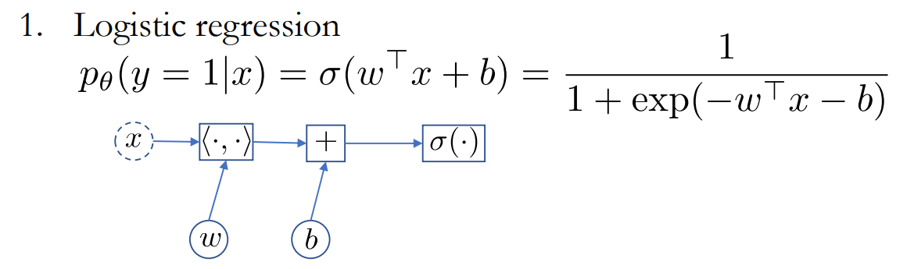
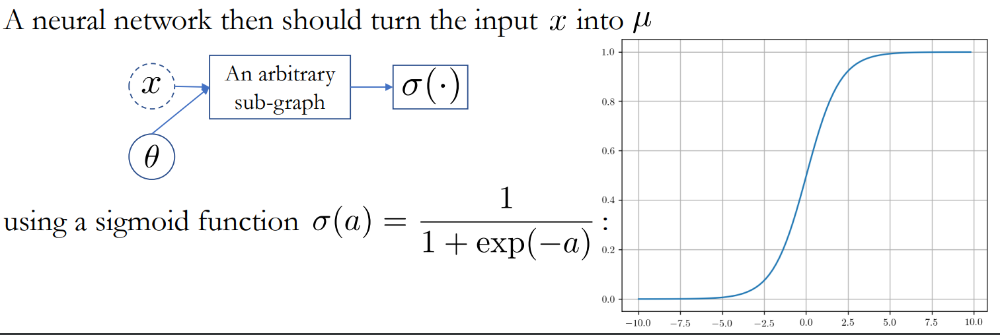
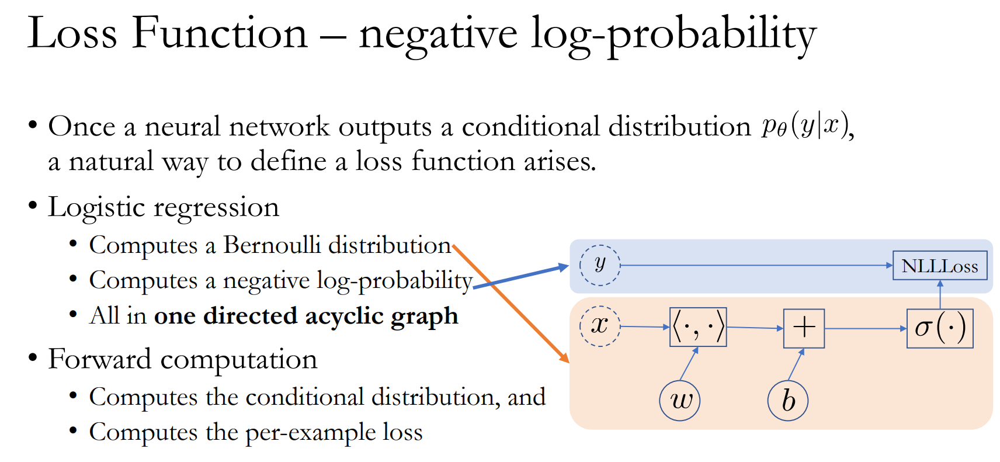

## 목차

- [[1] Overview](#1-overview)
  - [(1) 학습목표](#1-학습목표)
  - [(2) 핵심키워드](#2-핵심키워드)
  - [(3) 학습내용](#3-학습내용)
  	- [(4) 교수님 말씀](#4-교수님-말씀)

- [[2] Hypothesis Set](#2-hypothesis-set)
  - [(1) 학습목표](#1-학습목표-1)
  - [(2) 핵심 키워드](#2-핵심-키워드)
  - [(3) 학습내용](#3-학습내용-1)
  - [(4) 교수님 말씀](#4-교수님-말씀-1)

- [[3] Loss Function - Preview](#3-loss-function---preview)
  - [(1) 학습목표](#1-학습목표-2)

  - [(2) 핵심키워드](#2-핵심키워드-1)

  - [(3) 학습내용](#3-학습내용-2)

    

- [[4] Probability](#4-probability)
  - [(1) 학습목표](#1-학습목표-3)
  - [(2) 핵심키워드](#2-핵심키워드-2)
  - [(3) 학습내용](#3-학습내용-3)

- [[5] Loss Function](#5-loss-function)
  - [(1) 학습목표](#1-학습목표-4)
  - [(2) 핵심키워드](#2-핵심키워드-3)
  - [(3) 학습내용](#3-학습내용-4)

  - [(4) 교수님말씀](#4-교수님말씀-1)

- [[]](#)

  - [(1) 학습목표](#1-학습목표-5)
  - [(2) 핵심키워드](#2-핵심키워드-4)
  - [(3) 학습내용](#3-학습내용-5)
  - [(4) 교수님말씀](#4-교수님말씀-2)

## [1] Overview

### (1) 학습목표

머신러닝이 무엇인지, 머신러닝의 학습 진행 과정을 공부합니다.

### (2) 핵심키워드

- 알고리즘(Algorithm)
- 머신러닝(Machine Learning)
- 지도학습(Supervised Learning)
- 가설 집합(Hypothesis Sets) - 가설이란 이 문제를 풀기위한 알고리즘, 모델 아키텍쳐를 설정하는 과정입니다.
  - SVM, Tree 등
- 훈련 샘플(Training Examples)
- 검정 세트(Validation Set)
- 테스트 세트(Test Set)
- 비용 함수(Loss Function)
- 최적화 알고리즘(Optimization algorithm) -  Loss를 낮출 수 있는 머신을 찾을 수 있는 지에 대한 학습 방법을 결정합니다.

### (3) 학습내용

+ 지도학습에서 결정해야할 일
  + Porvided
    + Training Set
    + Loss Function
    + Validation Set, Test Set
  + Decide
    + 가설집합
    + 최적화 알고리즘

- 모든 것이 결정 되면, 지도학습은 각 가설 $H_m$ 에 대하여 최적화 알고리즘을 사용해 제일 좋은 모델을 찾습니다.

  - Given:

    - $D_{\text {train }}=\left(x_1, y_1\right), \cdots,\left(x_N, y_N\right), D_{v a l}, d_{\text {test }}$

    - $L(M(x), y) \geq 0 $

    - $H_1, \cdots, H_M$

    - Optimization Algorithm

      

  - 과정:

    1. [Training] 각 가설마다, Training Set 을 사용해서 퍼포먼스가 제일 좋은 모델들을 찾습니다. 
       $$
       \hat{M}_m=\arg \min _{M \in H_m} \sum_{(x, y) \in D} L(M(x), y)
       $$

    2. [Model Selection] Validation Set 을 사용해서 훈련된 모델들 중에 제일 좋은 모델을 선택합니다. 
       $$
       \hat{M}_m=\arg \min _{M \in H_m} \sum_{(x, y) \in D_{v a l}} L(M(x), y)
       $$

    3. [Reporting] Test Set 를 사용해서 제일 좋은 모델의 퍼포먼스를 측정합니다.
       $$
       R(\hat{M}) \approx \frac{1}{\left|D_{\text {test }}\right|} \sum_{(x, y) \in D_{\text {test }}} L(\hat{M}(x), y)
       $$

#### (4) 교수님 말씀

+ 앞으로 우리는 3가지를 정해야 함

  + **가설집합**

  + **비용함수**

  + **최적화 알고리즘**

+ 가장 중요한 것은 reporting할 때와 Training할 때, model selection할 때의 set이 완전히 구분이 되어져 있어야 함

+ 하이퍼파라미터 정해나가면, 그만큼 가설 집합도 늘어나는 것

+ 내가 갖고있는 가설집합 안에서 좋은 모델을 찾기 위한(최적화 알고리즘을 쓰기위해선) 쓰고 싶은 proxy loss function 정해야 하는데, 어떻게 정할 것인지 & 최적화는 어떻게 할 것인지에 대해 이야기 할 것

## [2] Hypothesis Set

### (1) 학습목표

가설집합을 어떤 방식으로 정하는지 학습합니다.

### (2) 핵심 키워드

- 가설집합(Hypothesis set)
- 하이퍼파라미터(Hyperparameter)
- 지도학습(Supervised Learning)
- 네트워크 아키텍처(The architecture of a network)
- 가중치 매개변수(weight parameter)
- 비순환 그래프(An (arbitrary) directed acyclic graph)
- 인공신경망(Neural Network)
- 객체 지향 패러다임(Object-oriented paradigm)

### (3) 학습내용

- **가설 집합은 무수히 많습니다.**

  - 머신러닝 접근 방법, 모델 구조, 하이퍼파라미터 등 요소를 하나씩 변화할 때 마다 가설 하나가 세워지기 때문입니다.
    - 머신러닝 접근 방법 -  SVM  / NN
    - 모델 구조 - Gausian kernel   / Res-Net
    - 하이퍼파라미터 - Bandwidth 1.5 /  weight 얼마

- 이번 강의 에서는 **딥러닝에 한정** 지어서 이야기 하겠습니다.

- 1. **네트워크 아키텍처가 정해지면, 하나의 가설 집합**이 됩니다.

- 2. 각기 다른 가중치 매개변수 값에 따라서 가설 집합에 속한 모델이 달라집니다. 
     + 아키텍쳐 내부에, 튜닝 파라미터들(weight, bias 등) 정하기

- 그렇다면 네트워크 아키텍처를 어떻게 정해야 할까요?

  - 명확한 정답은 없습니다. 
  - **다만 네트워크 아키텍처가 정해지면 그 뒤부터는 모든 것이 자동화 과정**으로 넘어가는데, 어떻게 이것이 가능한지 알아봅시다.

- 인공신경망은 무엇일까요?

- - **비순환 그래프(DAG)** 라고 할 수 있습니다. 

    

  - 각 노드들은 이미 Tensorflow, Pytorch 등 패키지에서 잘 정의되어 있습니다. 여러분은 이 노드들을 어떻게 연결 시킬지에 집중하면 됩니다.

  -  장점:

    - 높은 수준의 추상화가 되어있으며, 비순환 그래프 안에 있는 노드들이 어떻게 구현되있고, 벡엔드 에서 어떻게 쓰고 있는지 고려할 필요가 없습니다.
    - 객체 지향 프로그래밍 패러다임에 적합합니다.
      + variable, operation, input, output class  를 서로 계속 이어주면 됨
    - 코드 재사용이 용이합니다.

### (4) 교수님 말씀

+ 가설집합은 하나하나가 무한히 크고, 가설집합 자체도 무한하게 많이 있다.
  + 분류
    + SVM, 나이브 베이즈, 로지스틱 회귀, 가우시안 프로세스, 트리, NN 등 매우 많다
    + SVM으로 정해도, Kernel function을 뭘 쓸지 -> 가우시안 kernel 쓰면 bandwidth가 몇일지

+ 딥러닝 논문이 폭발적으로 늘어난 이유

  + 노드연결 방법과 노드 몇개 쓸지만 정하면 된다.

  + forward propagation 같은 것 일일이 계산 안해도 된다.

    

+ NN에서 **가설 집합을 결정을 한다는 것은 Directed asyclic graph(유향 비순환 그래프)를 만드는 것이다.**

+ **그래프를 만들고 나면, 파라미터들의 값이 무엇인지 결정하는 것이 training**

## [3] Loss Function - Preview

### (1) 학습목표

비용함수를 어떻게 정할지 고민해봅니다.

### (2) 핵심키워드

- 비용함수(Loss Function)
- 확률 분포 기반(distribution-based)

### (3) 학습내용

- 다양한 비용함수는 어떻게 정의되고, 어떤 상황에서 어떤 비용함수를 사용해야 할까요?

  - Classification: hinge loss, log-loss,
  - Regression: mean squared error, mean absolute error, robust loss, …

- 이 수업에서는 확률 분포에 따라서 자연스럽게 비용함수를 정의 하는 방법을 배웁니다.

  

### 

## [4] Probability

### (1) 학습목표

확률이론을 다시 한번 복습해봅니다.

### (2) 핵심키워드

- 확률(Probability)

- 사건 집합(Event Set)

- 확률변수(Random Variable)

- 결합확률(Joint probability)

- 조건부 확률(Conditional probability)

- 한계 확률(Marginal probability)

  

### (3) 학습내용

- 사건집합(Event Set) : 모든 가능한 사건의 집합

- - 이벤트 갯수가 유한일때 : 이산(Descrete)
  - 이벤트 갯수가 무한일때 : 연속(Continuous)

- 특성(Properties)
  1. **Non-negatives: 확률은 비음수**입니다.
  2. **Unit volume: 모든 확률의 합은 1**이 되어야 합니다.

- 결합확률(Joint probability)

- 조건부 확률(Conditional probability)

- 한계 확률(Marginal probability)

  

### 

## [5] Loss Function

### (1) 학습목표

지도학습에서 비용함수의 정의를 학습합니다.

### (2) 핵심키워드

- 지도학습(Supervised Learning)

- 비용함수(Loss Function)

- 최대 우도 추정(Maximum Likelihood Estimation)

  

### (3) 학습내용

- 지도학습은 Input(x) 값을 넣었을 때 Output(y) 값을 산출 하는 것입니다. 하지만 조금만 다르게 생각해서, **Input(x) 값이 주어졌을 때 의 Output(y) 값이 y’ 일 확률을 구하는 것**으로 생각할 수 있습니다.
  $$
  f_\theta(x)=? \quad \rightarrow \quad p\left(y=y^{\prime} \mid x\right)=?
  $$

- 어떤 확률 분포들이 있을까요?

- - 이진 분류: 베르누이(Bernoulli) 분포
    $$
    p(y \mid x)=\mu^y(1-\mu)^{1-y} \text {, where } y \in\{0,1\}
    $$

    - sigmoid를 이용해서 0~1사이로 맞춰주기
    - 

    

  - 다중 분류: 카테고리(Categorical) 분포
    $$
    p(y=v \mid x)=\mu_v, \text { where } \sum \mu_v=1
    $$

    - 예 : 책의 카테고리 분류
    - softmax를 이용해서 0~1사이로 맞추기, $\operatorname{softmax}(a)=\frac{1}{\sum_{v=1}^C \exp \left(a_v\right)} \exp (a)$

  - 선형 회귀: 가우시안(Gaussian) 분포

  - 다항 회귀: 가우시안 믹스쳐(Mixture of Gaussians)

- 인공신경망 모델이 조건부 확률 분포를 출력하면 이를 사용해서 비용함수를 정의 할 수 있습니다.

- - 최대한 모델이 출력한 조건부 확률 분포가 훈련 샘플의 확률분포와 같게 만드는 것입니다. 즉 모든 훈련 샘플이 나올 확률을 최대화 하는 것입니다.
  - $\underset{\theta}{\operatorname{argmax}} \log p_\theta(D)=\underset{\theta}{\operatorname{argmax}} \sum_{n=1}^N \log p_\theta\left(y_n \mid x_n\right)$
    - 이렇게 함으로서 자동으로 비용함수를 정의 할 수 있습니다. 이를 **최대 우도 추정**(Maximum Likelihood Estimation)라고 합니다.
  - 

- Log 를 사용하는 이유는 여러가지가 있음

  - 단조증가 함수로, 최대최소값 위치 보존

  - 곱 -> 합

  - 지수항을 다항식으로 변환

    

- 또한 최소화를 하기 위해서 앞에 마이너스 부호를 붙여줍니다. (-1 을 곱합니다.)

- 최종적으로, 비용함수는 **음의 로그확률(Negative Log-probabilities)의 합**(negative log likelihood)으로 결정됩니다.

  - $L(\theta)=\sum_{n=1}^N l\left(M_\theta\left(x_n\right), y_n\right)=-\sum_{n=1}^N \log p_\theta\left(y_n \mid x_n\right)$

- 예시

  

### (4) 교수님말씀

+ 2가지 관점

  1. 확률이 1인 y prime을 찾는 것

  2. **어떤 게 더 likeli하고, 덜 likeli한지 찾는 것**

+ **NN의 Output이 probability distribution**이라고 한다면, 자연스럽게 Loss function을 어떻게 주어야 하는지 알게 됨

  + 이유는 Training Set을 re-generate 잘하는 모델이, 적합한 모델인데, 이는 distribution을 보면 알 수 있음
  + 그 **Output의 확률이 얼마인지 볼 것이고, 그 확률이 가장 높아지는 ML model을 찾을 것임**

$$\theta$$

$\theta$
$$
\theta
$$

---

## [] 

### (1) 학습목표

### (2) 핵심키워드

### (3) 학습내용

### (4) 교수님말씀