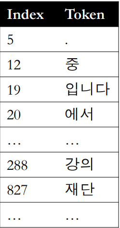
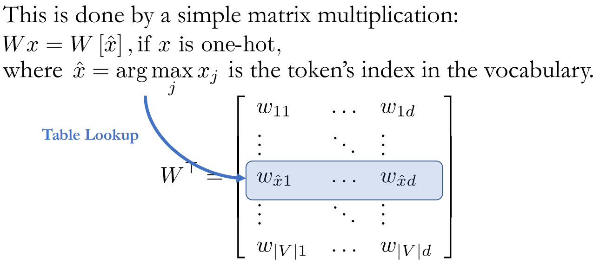

## [1] Overview

### (1) 학습목표

자연어 처리에서 텍스트 분류 문제를 다뤄봅니다.

### (2) 핵심키워드

- 텍스트 분류(Text Classification)

- 문장표현(Sentence Representation)

  

### (3) 학습내용

+ 텍스트 분류(Text Classification)

  + 문장, 문단 또는 글을 어떤 카테고리에 분류하는 작업을 텍스트 분류라고 합니다.
    - 텍스트 분류는 지도학습입니다.

  + Input: 하나의 문장, 문단 혹은 문서

  + Output: 유한한 C 개의 카테고리

+ 예시

- - Sentiment analysis(감성분석): is this review positive or negative? 
  - Text categorization(카테고리 분류): which category does this blog post belong to? 
  - Intent classification(의도 분류): is this a question about a Chinese restaurant?

 

### (4) 교수님말씀

+ Text categorization에서 지도학습이 어떻게 쓰이는지 살펴 볼 것
  + NN으로 할 때는, sentence represetation(representation learning)이 무엇인지 자연스럽게 생각하게 됨

## [2] How to represent sentence & token

### (1) 학습목표

문장을 어떻게 컴퓨터 언어로 표현할지 배웁니다.

### (2) 핵심키워드

- 토큰(tokens)

- 단어장(Vocabulary)

- 인코딩(Encoding)

  - one hot encoding

- 연속 벡터 공간(Continuous vector space)

- Table Lookup

  

### (3) 학습내용

- 문장은 일련의 토큰(tokens)으로 구성되어 있습니다. 텍스트 토큰은 주관적, 임의적(arbitrary)인 성격을 띄고 있습니다. 

- 토큰을 나누는 기준은 다양합니다.

- - 공백(White space)
  - 형태소(Morphs)
  - 어절
  - 비트숫자

- 컴퓨터에게 단어를 숫자로 표현하기 위해서, 단어장(Vocabulary)을 만들고, 중복되지 않는 인덱스(index) 로 바꿉니다.

  

- 궁극적으로 모든 문장을 일련의 정수로 바꿔줍니다. 이를 **인코딩(Encoding)**이라고 합니다.

  - 하지만 관계없는 숫자의 나열로 인코딩하는 것은 우리가 원하는 것이 아닙니다. 여전히 주관적인 숫자들 뿐입니다.

- 우리는 비슷한 의미의 단어는 같이 있고, 아니면 멀리 떨어져 있는 관계를 만들고 싶습니다. 그렇다면 어떻게 관계를 만들어 줘야 할까요?

- - 한 가지 방법으로 "**One hot Encoding**"이 있을 수 있습니다.
    - 길이가 단어장의 총 길이(∣*V*∣)인 벡터에서, 단어의 index 위치에 있는 값은 1, 나머지는 0으로 구성합니다.
    - $ x=[0,0,0,⋯,0,1,0,⋯,0,0] \in \{0,1\}^{∣V∣}$ 
    - **단점:** 모든 토큰 간에 거리가 같습니다. 하지만 모든 단어의 뜻이 같지 않기 때문에 거리가 달라져야 저희가 원하는 단어간의 관계가 성립 됩니다. 

- 어떻게 신경망이 토큰의 의미를 잡아낼수 있을까요?

- - 결론은 **각 토큰을 연속 벡터 공간(Continuous vector space) 에 투영**하는 방법입니다. 이를 **임베딩(Embedding)** 이라고도 합니다.

    

  - **Table Look Up**: 각 one hot encoding 된 토큰에게 벡터를 부여하는 과정입니다. 실질적으로 one hot encoding 벡터( $x$ )와 연속 벡터 공간( $W$ )을 내적 한 것 입니다.

    - Table Look Up 과정을 거친후* 모든 문장 토큰은 연속적이고 높은 차원의 벡터로 변합니다.
      - \* The table-lookup operation would be one node in the DAG
    -  $X=(e_1,e_2, \cdots ,e_T) $, where $e^t \in R^d$ 

- 

- 

### (4) 교수님말씀

+ 가장 처음 해야하는 것은 문장을 어떻게 컴퓨터가 알게 하느냐? (sentence representation)
  + 이미지와 다른 언어의 특징은 토큰이 굉장히 arbitrary하다는 것 
    + 왜 개는 개고 고양이는 고양이이고, 왜 개와 늑대는 실제로 비슷한데 글자는 완전 다른지?
+ 원하는 것은 Encoding된 토큰들의 의미를 NN이 잡아낼 수 있게 하는 것
  + 비슷한 것은 가깝고, 아닌 것은 멀게
    + 고양이와 호랑이가 가깝고, 개와 늑대가 가깝고, 이들이 의자와 책상과의 거리보다는 서로 가깝게

+ 토큰을 연속 벡터 공간에 투영하여, 벡터들이 토큰들의 의미를 가지고 있도록 함

+ Table Lookup
  + 토큰에 대한 의미를 갖고 있는 벡터를 찾는 것
+ 문제는 input의 size가 계속 바뀌면(예를들어 문장길이), 어떻게 fix size represetation을 찾을 수 있느냐?
  + 문장에 대한 의미를 갖고 있는 벡터를 찾을 수 있느냐? 가 굉장히 중요함

### (5) 정리

+  토큰을 연속 벡터 공간(Continuous vector space) 에 투영하는 것이 무엇이지 모르겠다.

---

## [] 

### (1) 학습목표

### (2) 핵심키워드

### (3) 학습내용

### (4) 교수님말씀