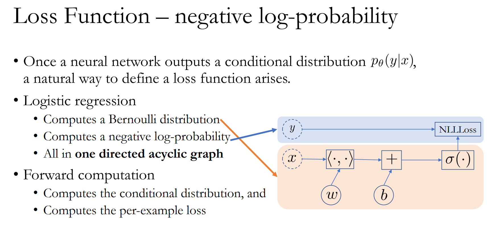
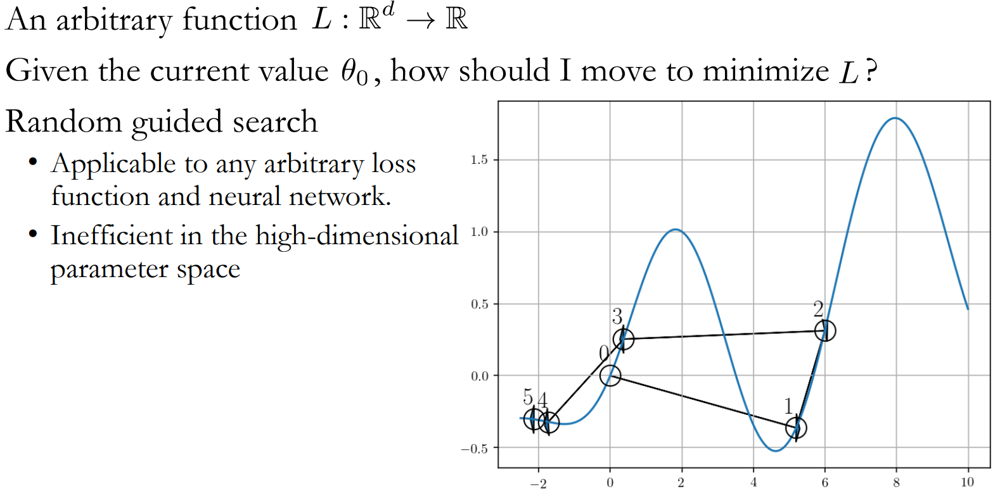
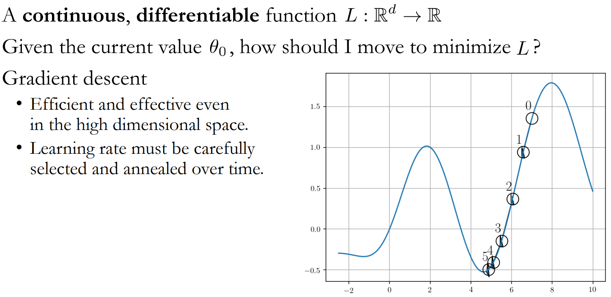
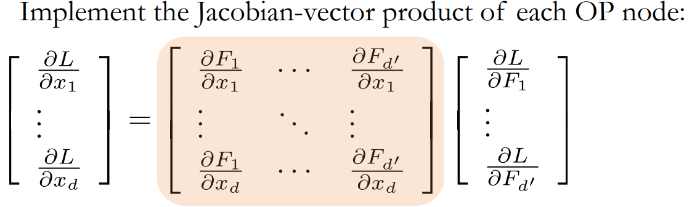
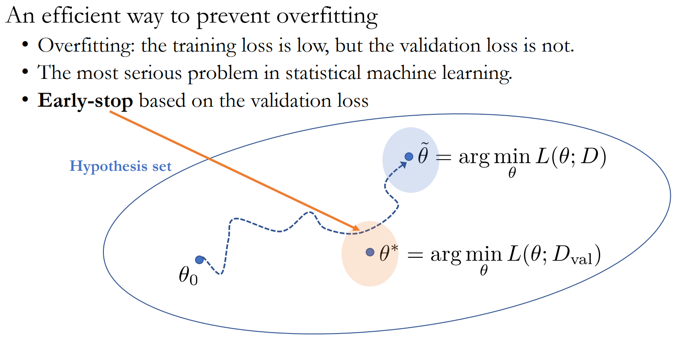
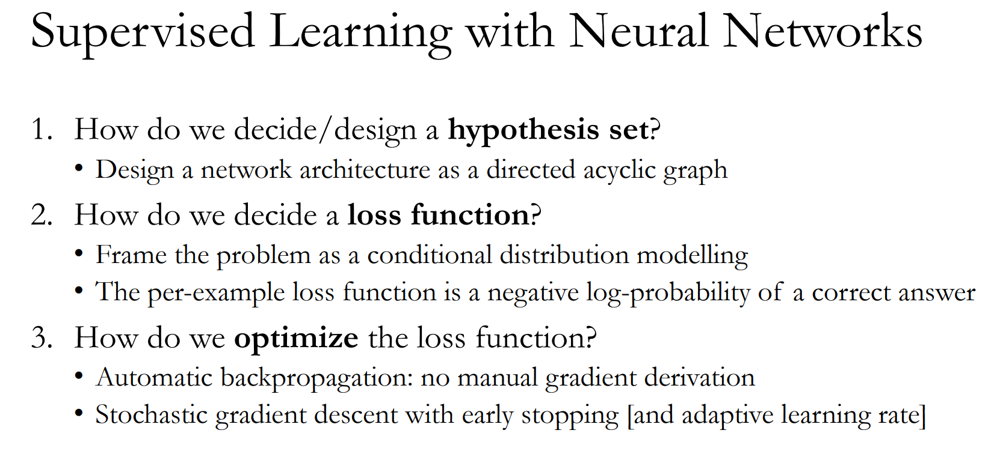

## 목차

- [[1] Overview](#1-overview)
  - [(1) 학습목표](#1-학습목표)
  - [(2) 핵심키워드](#2-핵심키워드)
  - [(3) 학습내용](#3-학습내용)
  - [(4) 교수님 말씀](#4-교수님-말씀)

- [[2] Hypothesis Set](#2-hypothesis-set)
  - [(1) 학습목표](#1-학습목표-1)
  - [(2) 핵심 키워드](#2-핵심-키워드)
  - [(3) 학습내용](#3-학습내용-1)
  - [(4) 교수님 말씀](#4-교수님-말씀-1)
  
- [[3] Loss Function - Preview](#3-loss-function---preview)
  - [(1) 학습목표](#1-학습목표-2)
  - [(2) 핵심키워드](#2-핵심키워드-1)
  - [(3) 학습내용](#3-학습내용-2)

- [[4] Probability](#4-probability)
  - [(1) 학습목표](#1-학습목표-3)
  - [(2) 핵심키워드](#2-핵심키워드-2)
  - [(3) 학습내용](#3-학습내용-3)

- [[5] Loss Function](#5-loss-function)
  - [(1) 학습목표](#1-학습목표-4)
  - [(2) 핵심키워드](#2-핵심키워드-3)
  - [(3) 학습내용](#3-학습내용-4)

  - [(4) 교수님말씀](#4-교수님말씀)
  - [(5) 내 요약](#5-내-요약)

- [[6] optimization methods](#6-optimization-methods)
  - [(1) 학습목표](#1-학습목표-5)
  - [(2) 핵심키워드](#2-핵심키워드-4)
  - [(3) 학습내용](#3-학습내용-5)
  - [(4) 교수님말씀](#4-교수님말씀-1)

- [[7] Backpropagation](#7-backpropagation)
  - [(1) 학습목표](#1-학습목표-6)
  - [(2) 핵심키워드](#2-핵심키워드-5)
  - [(3) 학습내용](#3-학습내용-6)
  - [(4) 교수님말씀](#4-교수님말씀-2)

- [[8] Gradient-Based Optimization](#8-gradient-based-optimization)
  - [(1) 학습목표](#1-학습목표-7)
  - [(2) 핵심키워드](#2-핵심키워드-6)
  - [(3) 학습내용](#3-학습내용-7)
  - [(4) 교수님말씀](#4-교수님말씀-3)

- [[9] Summary & QnA](#9-summary--qna)
  - [(1) 학습목표](#1-학습목표-8)
  - [(2) 핵심키워드](#2-핵심키워드-7)
  - [(3) 학습내용](#3-학습내용-8)
  - [(4) 교수님말씀](#4-교수님말씀-4)
  - [(5) QnA](#5-qna)

## [1] Overview

### (1) 학습목표

머신러닝이 무엇인지, 머신러닝의 학습 진행 과정을 공부합니다.

### (2) 핵심키워드

- 알고리즘(Algorithm)
- 머신러닝(Machine Learning)
- 지도학습(Supervised Learning)
- 가설 집합(Hypothesis Sets) - 가설이란 이 문제를 풀기위한 알고리즘, 모델 아키텍쳐를 설정하는 과정입니다.
  - SVM, Tree 등
- 훈련 샘플(Training Examples)
- 검정 세트(Validation Set)
- 테스트 세트(Test Set)
- 비용 함수(Loss Function)
- 최적화 알고리즘(Optimization algorithm) -  Loss를 낮출 수 있는 머신을 찾을 수 있는 지에 대한 학습 방법을 결정합니다.

### (3) 학습내용

+ 지도학습에서 결정해야할 일
  + Porvided
    + Training Set
    + Loss Function
    + Validation Set, Test Set
  + Decide
    + 가설집합
    + 최적화 알고리즘

- 모든 것이 결정 되면, 지도학습은 각 가설 $H_m$ 에 대하여 최적화 알고리즘을 사용해 제일 좋은 모델을 찾습니다.

  - Given:

    - $D_{\text {train }}=\left(x_1, y_1\right), \cdots,\left(x_N, y_N\right), D_{v a l}, d_{\text {test }}$

    - $L(M(x), y) \geq 0 $

    - $H_1, \cdots, H_M$

    - Optimization Algorithm

      

  - 과정:

    1. [Training] 각 가설마다, Training Set 을 사용해서 퍼포먼스가 제일 좋은 모델들을 찾습니다. 

       $$\hat{M}_m=\arg \min _{M \in H_m} \sum_{(x, y) \in D} L(M(x), y)$$

    2. [Model Selection] Validation Set 을 사용해서 훈련된 모델들 중에 제일 좋은 모델을 선택합니다. 

       $$\hat{M}_m=\arg \min _{M \in H_m} \sum_{(x, y) \in D_{v a l}} L(M(x), y)$$

    3. [Reporting] Test Set 를 사용해서 제일 좋은 모델의 퍼포먼스를 측정합니다.

       $$R(\hat{M}) \approx \frac{1}{\left|D_{\text {test }}\right|} \sum_{(x, y) \in D_{\text {test }}} L(\hat{M}(x), y)$$

#### (4) 교수님 말씀

+ 앞으로 우리는 3가지를 정해야 함

  + **가설집합**

  + **비용함수**

  + **최적화 알고리즘**

+ 가장 중요한 것은 reporting할 때와 Training할 때, model selection할 때의 set이 완전히 구분이 되어져 있어야 함

+ 하이퍼파라미터 정해나가면, 그만큼 가설 집합도 늘어나는 것

+ 내가 갖고있는 가설집합 안에서 좋은 모델을 찾기 위한(최적화 알고리즘을 쓰기위해선) 쓰고 싶은 proxy loss function 정해야 하는데, 어떻게 정할 것인지 & 최적화는 어떻게 할 것인지에 대해 이야기 할 것

+ **Model Selection은 Validation set으로**

[목차](#목차)

## [2] Hypothesis Set

### (1) 학습목표

가설집합을 어떤 방식으로 정하는지 학습합니다.

### (2) 핵심 키워드

- 가설집합(Hypothesis set)
- 하이퍼파라미터(Hyperparameter)
- 지도학습(Supervised Learning)
- 네트워크 아키텍처(The architecture of a network)
- 가중치 매개변수(weight parameter)
- 비순환 그래프(An (arbitrary) directed acyclic graph)
- 인공신경망(Neural Network)
- 객체 지향 패러다임(Object-oriented paradigm)

### (3) 학습내용

- **가설 집합은 무수히 많습니다.**

  - 머신러닝 접근 방법, 모델 구조, 하이퍼파라미터 등 요소를 하나씩 변화할 때 마다 가설 하나가 세워지기 때문입니다.
    - 머신러닝 접근 방법 -  SVM  / NN
    - 모델 구조 - Gausian kernel   / Res-Net
    - 하이퍼파라미터 - Bandwidth 1.5 /  weight 얼마

- 이번 강의 에서는 **딥러닝에 한정** 지어서 이야기 하겠습니다.

- 1. **네트워크 아키텍처가 정해지면, 하나의 가설 집합**이 됩니다.

- 2. 각기 다른 가중치 매개변수 값에 따라서 가설 집합에 속한 모델이 달라집니다. 
     + 아키텍쳐 내부에, 튜닝 파라미터들(weight, bias 등) 정하기

- 그렇다면 네트워크 아키텍처를 어떻게 정해야 할까요?

  - 명확한 정답은 없습니다. 
  - **다만 네트워크 아키텍처가 정해지면 그 뒤부터는 모든 것이 자동화 과정**으로 넘어가는데, 어떻게 이것이 가능한지 알아봅시다.

- 인공신경망은 무엇일까요?

- - **비순환 그래프(DAG)** 라고 할 수 있습니다. 

    

  - 각 노드들은 이미 Tensorflow, Pytorch 등 패키지에서 잘 정의되어 있습니다. 여러분은 이 노드들을 어떻게 연결 시킬지에 집중하면 됩니다.

  -  장점:

    - 높은 수준의 추상화가 되어있으며, 비순환 그래프 안에 있는 노드들이 어떻게 구현되있고, 벡엔드 에서 어떻게 쓰고 있는지 고려할 필요가 없습니다.
    - 객체 지향 프로그래밍 패러다임에 적합합니다.
      + variable, operation, input, output class  를 서로 계속 이어주면 됨
    - 코드 재사용이 용이합니다.

### (4) 교수님 말씀

+ 가설집합은 하나하나가 무한히 크고, 가설집합 자체도 무한하게 많이 있다.
  + 분류
    + SVM, 나이브 베이즈, 로지스틱 회귀, 가우시안 프로세스, 트리, NN 등 매우 많다
    + SVM으로 정해도, Kernel function을 뭘 쓸지 -> 가우시안 kernel 쓰면 bandwidth가 몇일지

+ 딥러닝 논문이 폭발적으로 늘어난 이유

  + 노드연결 방법과 노드 몇개 쓸지만 정하면 된다.

  + forward propagation 같은 것 일일이 계산 안해도 된다.

    

+ NN에서 **가설 집합을 결정을 한다는 것은 Directed asyclic graph(유향 비순환 그래프)를 만드는 것이다.**

+ **그래프를 만들고 나면, 파라미터들의 값이 무엇인지 결정하는 것이 training**

[목차](#목차)

## [3] Loss Function - Preview

### (1) 학습목표

비용함수를 어떻게 정할지 고민해봅니다.

### (2) 핵심키워드

- 비용함수(Loss Function)
- 확률 분포 기반(distribution-based)

### (3) 학습내용

- 다양한 비용함수는 어떻게 정의되고, 어떤 상황에서 어떤 비용함수를 사용해야 할까요?

  - Classification: hinge loss, log-loss,
  - Regression: mean squared error, mean absolute error, robust loss, …

- 이 수업에서는 확률 분포에 따라서 자연스럽게 비용함수를 정의 하는 방법을 배웁니다.

  

### 

## [4] Probability

### (1) 학습목표

확률이론을 다시 한번 복습해봅니다.

### (2) 핵심키워드

- 확률(Probability)

- 사건 집합(Event Set)

- 확률변수(Random Variable)

- 결합확률(Joint probability)

- 조건부 확률(Conditional probability)

- 한계 확률(Marginal probability)

  

### (3) 학습내용

- 사건집합(Event Set) : 모든 가능한 사건의 집합

- - 이벤트 갯수가 유한일때 : 이산(Descrete)
  - 이벤트 갯수가 무한일때 : 연속(Continuous)

- 특성(Properties)
  1. **Non-negatives: 확률은 비음수**입니다.
  2. **Unit volume: 모든 확률의 합은 1**이 되어야 합니다.

- 결합확률(Joint probability)

- 조건부 확률(Conditional probability)

- 한계 확률(Marginal probability)

  

## [5] Loss Function

### (1) 학습목표

지도학습에서 비용함수의 정의를 학습합니다.

### (2) 핵심키워드

- 지도학습(Supervised Learning)

- 비용함수(Loss Function)

- 최대 우도 추정(Maximum Likelihood Estimation)

  

### (3) 학습내용

- 지도학습은 Input(x) 값을 넣었을 때 Output(y) 값을 산출 하는 것입니다. 하지만 조금만 다르게 생각해서, **Input(x) 값이 주어졌을 때 의 Output(y) 값이 y’ 일 확률을 구하는 것**으로 생각할 수 있습니다.

  $$f_\theta(x)=? \quad \rightarrow \quad p\left(y=y^{\prime} \mid x\right)=?$$

- 어떤 확률 분포들이 있을까요?

- - 이진 분류: 베르누이(Bernoulli) 분포

    $$p(y \mid x)=\mu^y(1-\mu)^{1-y} \text {, where } y \in\{0,1\}$$

    

    - sigmoid를 이용해서 0~1사이로 맞춰주기
    - 

    

  - 다중 분류: 카테고리(Categorical) 분포
    $$
    p(y=v \mid x)=\mu_v, \text { where } \sum \mu_v=1
    $$

    - 예 : 책의 카테고리 분류
    - softmax를 이용해서 0~1사이로 맞추기, $\operatorname{softmax}(a)=\frac{1}{\sum_{v=1}^C \exp \left(a_v\right)} \exp (a)$

  - 선형 회귀: 가우시안(Gaussian) 분포

  - 다항 회귀: 가우시안 믹스쳐(Mixture of Gaussians)

- 인공신경망 모델이 조건부 확률 분포를 출력하면 이를 사용해서 비용함수를 정의 할 수 있습니다.

- - 최대한 모델이 출력한 조건부 확률 분포가 훈련 샘플의 확률분포와 같게 만드는 것입니다. 즉 모든 훈련 샘플이 나올 확률을 최대화 하는 것입니다.
  - $\underset{\theta}{\operatorname{argmax}} \log p_\theta(D)=\underset{\theta}{\operatorname{argmax}} \sum_{n=1}^N \log p_\theta\left(y_n \mid x_n\right)$
    - 이렇게 함으로서 자동으로 비용함수를 정의 할 수 있습니다. 이를 **최대 우도 추정**(Maximum Likelihood Estimation)라고 합니다.
  - 

- Log 를 사용하는 이유는 여러가지가 있음

  - 단조증가 함수로, 최대최소값 위치 보존

  - 곱 -> 합

  - 지수항을 다항식으로 변환

    

- 또한 최소화를 하기 위해서 앞에 마이너스 부호를 붙여줍니다. (-1 을 곱합니다.)

- 최종적으로, 비용함수는 **음의 로그확률(Negative Log-probabilities)의 합**(negative log likelihood)으로 결정됩니다.

  - $L(\theta)=\sum_{n=1}^N l\left(M_\theta\left(x_n\right), y_n\right)=-\sum_{n=1}^N \log p_\theta\left(y_n \mid x_n\right)$

- 예시

  

### (4) 교수님말씀

+ 2가지 관점

  1. 확률이 1인 y prime을 찾는 것

  2. **어떤 게 더 likeli하고, 덜 likeli한지 찾는 것**

+ **NN의 Output이 probability distribution**이라고 한다면, 자연스럽게 Loss function을 어떻게 주어야 하는지 알게 됨

  + 이유는 Training Set을 re-generate 잘하는 모델이, 적합한 모델인데, 이는 distribution을 보면 알 수 있음
  + 그 **Output의 확률이 얼마인지 볼 것이고, 그 확률이 가장 높아지는 ML model을 찾을 것임**

### (5) 내 요약

1. output 분포 설정
2. input x 와 weight, bias 이용해서, 분포의 parameter 생성
3. y값 넣어서 negative MLE 계산
4. netgative MLE 줄이는 방향으로 weight, bias update -> update 해도, 잘 안줄어들면 output 분포설정이 잘못된 것?

[목차](#목차)

## [6] optimization methods

### (1) 학습목표

비용함수를 최적화 시키는 방법을 학습합니다.

### (2) 핵심키워드

+ 최적화(Optimization)

  

### (3) 학습내용

+ What we now need to know 
  1. Choose an optimization algorithm. 
  2. How to use the optimization algorithm to estimate parameters $\theta$.

- Loss 는 비순환그래프(DAG)를 거쳐 계산됩니다.

- 가설이 무수히 많기 때문에 모든 것을 다 시도해보고 최적인 것을 고를 수가 없습니다.

- 따라서, 일단 아무 곳을 선택한 후에 Loss 를 낮추는 방향으로 최적화를 진행합니다.

- 방법:

- - Local, Iterative Optimization: Random Guided Search

  - - 장점: 어떤 비용함수를 사용해도 무관합니다.

    - 단점: 차원이 작을 때는 잘 되지만, 차원의 저주 때문에 커질 수록 오래걸립니다. 샘플링(sampling) 에 따라서 오래걸립니다.

    - 사용법 : random 하게 파라미터 위치 정해서, loss 계산하고, 잘 나오는 loss 근처에서 random하게 위치 정해서, loss 계산 반복

    - Random guided search 

      - Stochastically perturb $\theta_0$ : $\theta_k = \theta + \epsilon_k$, where $\epsilon_k \sim N(0, s^2I)$ 

      - Test each perturbed point $L(\theta_k)$

      - Find the best perturbed point $\theta_1 = argmin_{\theta_k} L(\theta_k)$

      - Repeat this until no improvement could be made.

        

- - **Gradient-based Optimization:**

  - - 미분을 통해 최적화 할 방향을 정합니다

    - 장점: Random Guided search 에 비해서 탐색영역은 작지만 확실한 방향은 정할 수 있습니다.

    - 단점: 학습률(Learning Rate)이 너무 크거나 작으면 최적의 값으로 못갈 수도 있습니다. 

    - 사용법 : 2번 미분가능시 뉴턴, 쿼진 뉴턴 , Hessian, FIM  / 1번 미분가능시 conjugate method

    - Gradient descent

      - The negative gradient of the function : $-\nabla L(\theta_0)$

      - $\theta_0$ 의 근방에서 $\theta = \theta_0 - \eta \nabla L(\theta_0)$

        

  - 

### (4) 교수님말씀

+ Gradient base Optimization을 쓴다
  + 2번 미분가능시 뉴턴, 쿼진 뉴턴 , Hessian, FIM  

[목차](#목차)

## [7] Backpropagation 

### (1) 학습목표

역전파 알고리즘과 자동 미분법에 대해 학습합니다.

### (2) 핵심키워드

- 역전파(Backpropagation)

- 자동 미분법(Automatic differentiation)

- 연쇄법칙(Chain rule)

  

### (3) 학습내용

- 자동 미분법(Automatic differentiation): 

  - 모델을 연결하는 비순환 그래프(DAG)는 미분 가능한 함수들로 구성되어 있습니다. 따라서 미분의 연쇄법칙을 사용하여 자동으로 미분합니다.

  - $\dfrac{\partial(f\circ g)}{\partial x} = \dfrac{\partial f}{\partial g} \dfrac{\partial g}{\partial x}$

    

- 과정:
  1. 각 노드에서 **Jacobian-vector product**을 계산합니다.
  2. 비순환 그래프(DAG) 역순으로 전파합니다.

- 장점:

- - Gradient 를 손으로 직접 계산할 필요가 없어졌습니다.
  - [front-end]와 [back-end]의 분리
    - [front-end] 비순환 그래프(DAG)를 만듬으로서 뉴럴넷(모델)을 디자인하는데 집중합니다.
    - [back-end] 디자인 된 비순환 그래프(DAG)는 타겟 컴퓨터 장치를 위한 효과적인 코드로 컴파일됩니다. Framework 개발자들이 타겟에 맞춰 알맞게 구현하면 사용자들은 Back-end를 신경쓰지 않고 쓸 수 있습니다. 

### (4) 교수님말씀

+ 가장 큰 문제가 Gradient를 어떻게 계산할지
+ 각 노드마다 미분 계산 방식을 정해두면(dot product의 미분 계산은 이렇게), 끝에서부터 앞으로 오면서, 미분값 계산한 거 곱해줄 수 있음

+ **Jacobian-vector product**

  + input $x_i, i = 1, \cdots d$ 가 조금씩 바뀔 때, output $F_j, j=1, \cdots, d^\prime$이 얼마나 바뀌는지 계산하기 위한 것

    

[목차](#목차)

## [8] Gradient-Based Optimization

### (1) 학습목표

경사기반 최적화기법에 대해 학습합니다.

### (2) 핵심키워드

- 경사기반 최적화기법(Gradient-Based Optimization)

- 확률적 경사 하강법(Stochastic Gradient descent)

- 미니배치(Mini batch)

- 과적합(Overfitting)

- 적응적 학습률(Adaptive Learning Rate)

  

### (3) 학습내용

- Off-the-shelf gradient-based optimization
  - Gradient descent, L-BFGS, Conjugate gradient 등 방법 들이 있습니다.
  - 그러나 위 방법들은 매개변수(parameters)가 많아질 수록 시간이 오래걸립니다.
  - 그 이유는 훈련 샘플 전체의 Loss 는 각 샘플에 대한 Loss 의 합으로 구해지며, 데이터가 많아 질 수록 오래 걸리기 때문입니다.

- 확률적 경사 하강법(Stochastic Gradient descent)

- - 가정은 "전체 비용은 훈련 샘플의 일부를 선택 후 나눠서 계산한 전체 비용의 근사값(Approximate)와 같다." 입니다. 

    

  - 과정:

  - 1. M개의 훈련 샘플을 선택합니다. 이를 **미니배치(Mini batch)** 라고 합니다.

        $D^′={(x_1,y_1),⋯,(x_N^′,y_N^′)} $

    2. 미니배치 경사를 계산합니다. (compute the minibatch gradient)

       $ \nabla L \approx \dfrac{1}{N^\prime}\sum_{n=1}^{N^\prime} \nabla l(M(x_{n}), y_{n})$

  - 3. 매개변수를 업데이트합니다.

       $\theta \leftarrow \theta - \eta \nabla L(\theta; D^\prime)$

    4. **검증 세트로 구한 validation loss 가 더 이상 진전이 없을때까지 진행합니다**

- **Early Stopping**

- - **과적합(Overfitting)을 방지**하기 위한 제일 좋은 알고리즘입니다.

    - 과적합 : training loss low & validation loss is not low

  - 검증 세트의 Loss 가장 낮은 곳에서 훈련을 멈춥니다.

    

- 적응적 학습률(Adaptive Learning Rate) (Adam [Kingma&Ba, 2015], Adadelta [Zeiler, 2015])

  - 확률적 경사 하강 법은 학습률에 민감합니다. 이를 보완하기 위해서 다양한 Adam, Adadelta 등 다양한 알고리즘이 나왔습니다.

    

### (4) 교수님말씀

+ 패키지로 있는 off-the-shelf gradient based 최적화 알고리즘은 파라미터가 10000개 까지는 어느정도 가능하지만, 더 커지면 계산 시간이 너무 오래 걸림
  + 왜냐하면, Loss function 1번 구하려면, 표본 개수만큼 NN을 계산해야 하고, 역전파 해서 파라미터 update하려면, 다시 표본 수만큼 계산해줘야 함 -> 너무 오래걸림
+ 그래서 training data 중 몇 개의 sample만 뽑아서 Gradient 계산하고 update 해준다. (Stocastic Gradient Descent)
  + 이론 상 특정 조건 하에서 UE
  + learning rate를 잘 조절하면, convergence rate를 전체에 대해서 계산하는 것과 같게 보장 가능
+ Overfitting을 막는 가장 효율적인 방법이 Early Stopping
+ Adaptive Learning Rate을 자동으로 정할 수 있느냐는 큰 토픽
  + 쿼진 뉴튼 메서드, L-BFGS, Conjugate gradient와 같은 advanced 한 최적화 방법이 learning rate를 자동으로 정해주는 것과 마찬가지인데, 대부분의 방법이 SGD에서는 잘 안됨
    + 그래서 나온 것이 (Adam [Kingma&Ba, 2015], Adadelta [Zeiler, 2015]), ada delta

[목차](#목차)

## [9] Summary & QnA

### (1) 학습목표

지금까지 배운 신경망 지도학습에 대해서 다시 한번 정리하고 복습합니다 

### (2) 핵심키워드

- 가설집합(Hypothesis set)

- 비용함수(Loss function)

- 최적화(Optimization)

- 역전파(Backpropagation)

- 확률적 경사 하강법(Stochastic Gradient descent)

  

### (3) 학습내용

### (4) 교수님말씀

1. NN에서 hypothesis set을 정하는 것 == DAG 아키텍쳐 정하는 것
   + 정해진 hypothesis set에서 가능한 파라미터 값개수만큼, 다른 모델이 있는 것

2. Loss function 정하는 방법 중 1가지
   + NN 자체를 input 주어졌을 때, 어떤 특정 y값의 확률을 output으로 내뱉도록 해놓으면, negative loglikelihood 로 Loss 생성
     + 즉, train x1, train y1 있으면, input에 x1넣으면 output에 y1이 나올 확률을 output으로 내뱉게 해놓음
       + 예 : 이진분류의 경우, input x1을 이용해서 $Y|X=x \sim Ber(\mu)$ 의 $\mu$ 에 대한 추정값이 output으로 나오게 됨
     + distribution을 output으로 내뱉게 설정하는 것이 핵심!

### (5) QnA

**1. 모델 아키텍쳐의 결정 방법 이론은 존재하나요? 어떻게 결정해야할까요?**

+ 이론적으로 봤을 때, 옵티멀을 알고 있는 것이 거의 없다.
  + 예전의 univeral approximation thm, generalization bound from learning theory, geometry
  + NN이 compositional function이므로, 어떤 function으로 composit되었느냐에 따라서, 어떤 것이 더 나은지 조금은 알 수 있음
  + Neural Architecture Search, meta learning
    + 모델 아키텍쳐를 x로, 성능을 y로 넣는 것

**2. 확률적 경사 하강법(Stochastic Gradient Descent)에서 확률적(Stochastic)은 무엇을 뜻하나요?**

+ deterministic은 계산할 때마다, 똑같은 값이 나옴
+ stochastic은 랜덤하게 고르므로, 계산 할 때마다 값이 다르게 나옴

**3. 베르누이분포에서 시그모이드 함수와 소프트맥스 함수를 쓰는게 어떤 차이가 있나요?**

+ output은 동일하지만, gradient는 동일하지 않음
  + function space에서는 동일하지만, NN의 parameter space에서 보면, 동일하지 않다.

**4. Early stopping을 사용해야하는 이유는 무엇입니까? 실제로 많이 쓰나요?**

+ 꼭 써야함 + 그 외 다른 것 추가로 씀(drop out 등)
+ SGD 자체의 문제로써 디버깅에서 살짝 문제가 될 수 있는 것은
  + 만약 고차원공간에서 어떤 함수가 주어졌고, SMOOTH하고 CONTINUOUS하다고 가정하자.
    + 미분 조금 잘못해서, 자코비안 프로덕트를 조금 잘못 계산하게 되도, 고차원이고, 노이지한 최적화 방법이므로, 정확한 방향이 아니더라도, LOSS는 조금씩 줄어듦
    + 그래서 Early stopping을 하게 되면, 과연 이게 코드에 버그가 있는 것인지, 없는 것인지, 잘하고 있는 것인지, 버그 없다면 더 잘했을지 알 수 없음 -> 버그 없다면, 무조건 Early stopping 써야함

**5. 편향된 데이터에서 확률적 경사 하강법을 사용할 수 있나요?? 예를들어 가장 최신 데이터가 중요하다고 할 때도 쓸 수 있나?**

+ SGD의 가정은 data가 IID다.
+ bias 가 뭔지 아는 경우
  + 예를 들어, 암 사진 sampling할 때, 그냥 sampling하면 대부분 정상이므로, 암 사진을 up sampling해서 bias가 생기게 됨
  + 몬테카를로 샘플링(메서드)를 써서, expectation approximation 하는 $ \nabla L \approx \dfrac{1}{N^\prime}\sum_{n=1}^{N^\prime} \nabla l(M(x_{n}), y_{n})$ 부분에서, unbiased된 것의 Unnormalized probability(nonnegative and has finite nonzero integral, )까지 안다면, 앞 식을 보정해서 쓸 수 있음(비율 맞춰서 $\sum$ 에 넣어주면 되는 것인듯
    + importance sampling 써도 됨
+ bias가 뭔지 모르는 경우
  + validation set을 natural data set과 최대한 같게 정교하게 만들어서 early stopping 하는 것이 최선

[목차](#목차)

## [] 

### (1) 학습목표

### (2) 핵심키워드

### (3) 학습내용

### (4) 교수님말씀