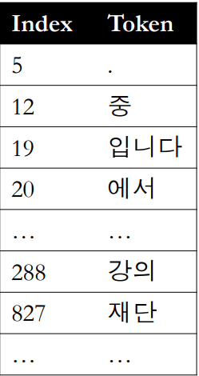
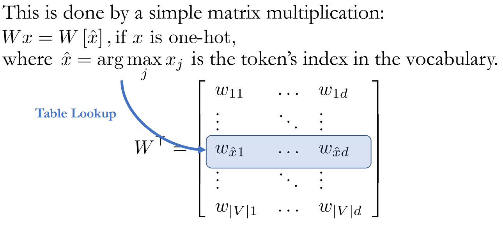
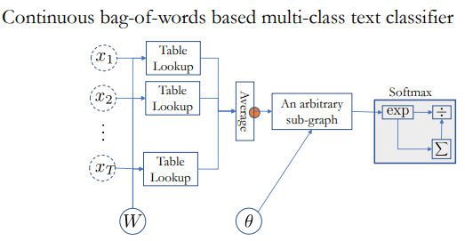
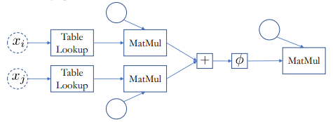
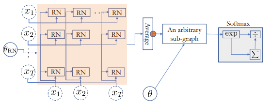

# Text Classification & Sentence Representation

## 목차

- [[1] Overview](#1-overview)
  - [(1) 학습목표](#1-학습목표)
  - [(2) 핵심키워드](#2-핵심키워드)
  - [(3) 학습내용](#3-학습내용)
  - [(4) 교수님말씀](#4-교수님말씀)
- [[2] How to represent sentence & token](#2-how-to-represent-sentence--token)

  - [(1) 학습목표](#1-학습목표-1)
  - [(2) 핵심키워드](#2-핵심키워드-1)
  - [(3) 학습내용](#3-학습내용-1)
  - [(4) 교수님말씀](#4-교수님말씀-1)
  - [(5) 정리](#5-정리)
  - [(6) 학습자료](#6-학습자료)

- [[3] CBoW & RN & CNN](#3-cbow--rn--cnn)

  - [(1) 학습목표](#1-학습목표-2)
  - [(2) 핵심키워드](#2-핵심키워드-2)
  - [(3) 학습내용](#3-학습내용-2)
  - [(4) 교수님말씀](#4-교수님말씀-2)
  - [(5) 학습자료](#5-학습자료)

- [[4] Self Attention & RNN](#4-self-attention--rnn)

  - [(1) 학습목표](#1-학습목표-3)
  - [(2) 핵심키워드](#2-핵심키워드-3)
  - [(3) 학습내용](#3-학습내용-3)
  - [(4) 교수님말씀](#4-교수님말씀-3)
  - [(5) 학습자료](#5-학습자료-1)

- [[5] Summary](#5-summary)

  - [(1) 학습목표](#1-학습목표-4)
  - [(2) 핵심키워드](#2-핵심키워드-4)
  - [(3) 학습내용](#3-학습내용-4)
  - [(4) 교수님말씀](#4-교수님말씀-4)
  - [(5) 학습자료](#5-학습자료-2)

- [[6] QnA](#6-qna)

  

## [1] Overview

### (1) 학습목표

자연어 처리에서 텍스트 분류 문제를 다뤄봅니다.

### (2) 핵심키워드

- 텍스트 분류(Text Classification)

- 문장표현(Sentence Representation)

  

### (3) 학습내용

+ 텍스트 분류(Text Classification)

  + 문장, 문단 또는 글을 어떤 카테고리에 분류하는 작업을 텍스트 분류라고 합니다.
    - 텍스트 분류는 지도학습입니다.

  + Input: 하나의 문장, 문단 혹은 문서

  + Output: 유한한 C 개의 카테고리

+ 예시

- - Sentiment analysis(감성분석): is this review positive or negative? 
  - Text categorization(카테고리 분류): which category does this blog post belong to? 
  - Intent classification(의도 분류): is this a question about a Chinese restaurant?

 

### (4) 교수님말씀

+ Text categorization에서 지도학습이 어떻게 쓰이는지 살펴 볼 것
  + NN으로 할 때는, sentence represetation(representation learning)이 무엇인지 자연스럽게 생각하게 됨

## [2] How to represent sentence & token

### (1) 학습목표

문장을 어떻게 컴퓨터 언어로 표현할지 배웁니다.

### (2) 핵심키워드

- 토큰(tokens)

- 단어장(Vocabulary)

- 인코딩(Encoding)

  - one hot encoding

- 연속 벡터 공간(Continuous vector space)

- Table Lookup

  

### (3) 학습내용

- 문장은 일련의 토큰(tokens)으로 구성되어 있습니다. 텍스트 토큰은 주관적, 임의적(arbitrary)인 성격을 띄고 있습니다. 

- 토큰을 나누는 기준은 다양합니다.

- - 공백(White space)
  - 형태소(Morphs)
  - 어절
  - 비트숫자

- 컴퓨터에게 단어를 숫자로 표현하기 위해서, 단어장(Vocabulary)을 만들고, 중복되지 않는 인덱스(index) 로 바꿉니다.

  

- 궁극적으로 모든 문장을 일련의 정수로 바꿔줍니다. 이를 **인코딩(Encoding)**이라고 합니다.

  - 하지만 관계없는 숫자의 나열로 인코딩하는 것은 우리가 원하는 것이 아닙니다. 여전히 주관적인 숫자들 뿐입니다.

- 우리는 비슷한 의미의 단어는 같이 있고, 아니면 멀리 떨어져 있는 관계를 만들고 싶습니다. 그렇다면 어떻게 관계를 만들어 줘야 할까요?

- - 한 가지 방법으로 "**One hot Encoding**"이 있을 수 있습니다.
    - 길이가 단어장의 총 길이(∣*V*∣)인 벡터에서, 단어의 index 위치에 있는 값은 1, 나머지는 0으로 구성합니다.
    - $ x=[0,0,0,⋯,0,1,0,⋯,0,0] \in \{0,1\}^{∣V∣}$ 
    - **단점:** 모든 토큰 간에 거리가 같습니다. 하지만 모든 단어의 뜻이 같지 않기 때문에 거리가 달라져야 저희가 원하는 단어간의 관계가 성립 됩니다. 

- 어떻게 신경망이 토큰의 의미를 잡아낼수 있을까요?

- - 결론은 **각 토큰을 연속 벡터 공간(Continuous vector space) 에 투영**하는 방법입니다. 이를 **임베딩(Embedding)** 이라고도 합니다.

    

  - **Table Look Up**: 각 one hot encoding 된 토큰에게 벡터를 부여하는 과정입니다. 실질적으로 one hot encoding 벡터( $x$ )와 연속 벡터 공간( $W$ )을 내적 한 것 입니다.

    - Table Look Up 과정을 거친후* 모든 문장 토큰은 연속적이고 높은 차원의 벡터로 변합니다.
      - \* The table-lookup operation would be one node in the DAG
    -  $X=(e_1,e_2, \cdots ,e_T) $, where $e^t \in R^d$ 

- 

- 

### (4) 교수님말씀

+ 가장 처음 해야하는 것은 문장을 어떻게 컴퓨터가 알게 하느냐? (sentence representation)
  + 이미지와 다른 언어의 특징은 토큰이 굉장히 arbitrary하다는 것 
    + 왜 개는 개고 고양이는 고양이이고, 왜 개와 늑대는 실제로 비슷한데 글자는 완전 다른지?
+ 원하는 것은 Encoding된 토큰들의 의미를 NN이 잡아낼 수 있게 하는 것
  + 비슷한 것은 가깝고, 아닌 것은 멀게
    + 고양이와 호랑이가 가깝고, 개와 늑대가 가깝고, 이들이 의자와 책상과의 거리보다는 서로 가깝게

+ 토큰을 연속 벡터 공간에 투영하여, 벡터들이 토큰들의 의미를 가지고 있도록 함

+ Table Lookup
  + 토큰에 대한 의미를 갖고 있는 벡터를 찾는 것
+ 문제는 input의 size가 계속 바뀌면(예를들어 문장길이), 어떻게 fix size represetation을 찾을 수 있느냐?
  + 문장에 대한 의미를 갖고 있는 벡터를 찾을 수 있느냐? 가 굉장히 중요함

### (5) 정리

+  토큰을 연속 벡터 공간(Continuous vector space) 에 투영하는 것이 무엇이지 모르겠다.

### (6) 학습자료

각 패키지 별로 Table look up 과정인 단어 임베딩에 대한 설명 및 튜토리얼

[ **Vector Representations of Words | TensorFlow**https://www.tensorflow.orgTensorFlow에서 Table look up 과정(Word Embedding)에 대한 설명과 튜토리얼입니다.](https://www.tensorflow.org/tutorials/representation/word2vec)

#### 워드임베딩 학습

[**Word Embeddings | Pytorch**https://pytorch.orgPytorch에서 Table look up 과정(Word Embedding)에 대한 설명과 튜토리얼입니다.](https://pytorch.org/tutorials/beginner/nlp/word_embeddings_tutorial.html)

## [3] CBoW & RN & CNN

### (1) 학습목표

문장을 표현하는 방법중 CBoW, RN, CNN 에 대해서 알아봅니다.

### (2) 핵심키워드

- 문장표현(Sentence representation)

- Continuous bag-of-words

- Relation Network

- Convolution Neural Network

  

### (3) 학습내용

- 문장표현(Sentence representation)의 의미: 어떤 과제를 풀기에 적합하고 숫자로 나타낸 문장의 표현입니다

- **CBoW**(Continuous bag-of-words):

- - 단어장을 단어 주머니로 보게되고, 이에 따라 단어의 **순서는 무시**합니다. 

  - 문장에 대한 표현은 단어 벡터들을 **평균시킨 벡터**로 구합니다.

    $ \dfrac{1}{T} \sum_{t=1}^T e_t$

  - 효과가 좋기 때문에 제일 먼저 시도해봐야합니다. (**Baseline 모델**)

  - 공간상에서 가까우면 비슷한 의미, 아니면 멀리 떨어져 있을 것입니다.

    - input이 문장이라면, 문장들이 비슷하면 가깝게, 아니면 멀게 떨어짐

    

  - In practice, use **FastText** [Bojanowski et al., 2017]

- **Relation Network**(Skip-Bigram)

- - 문장안에 있는 **모든 토큰 쌍**(pairs)을 보고, 각 쌍에 대해서 representation 찾아서, 신경망을 만들어서 문장표현을 찾습니다.

    $RN(X) = \dfrac{1}{2N(N-1)}\sum_{i=1}^{T-1}\sum_{j=i+1}^T f(x_i,x_j)$

    where, $f(x_i,x_j) = W \phi(U_{left}e_i + U_{right}e_j)$, 

    $\phi$ is  a element-wise nonlinear function, such as tanh or ReLU(max(0,a))

    

    

  - 장점: 여러 단어로 된 표현을 탐지 할 수 있습니다.

  - 단점: 모든 단어간의 관계를 보기 때문에, 전혀 연관이 없는 단어도 보게 됩니다.

    - SVO 형식이라면, 첫 단어와 마지막 단어 간의 연관이 중요할까?

- **Convolution Neural Network**(CNN)

  - 아이디어

    - Local 한 Feature를 많이 뽑겠다

  - 특징:

    - k-gram을 계층적으로(hierachically) 보게 됩니다.
    - **Layer 를 쌓을 때 마다, 점진 적으로 넓은 범위를 보기** 때문에, "단어> 다중 단어 표현> 구절 > 문장"순으로 보는 인간의 인식과도 알맞습니다. 
    - 1차원의 Convolutional Network 입니다.

  - 장점: 좁은 지역간 단어의 관계를 볼수 있습니다.

    

### (4) 교수님말씀

+ 머신러닝이 알고리즘 디자인이라면, 똑같은 프레임워크 그대로 써서 여러 곳에 사용할 수 있다.

+ SVO 형식의 문장에서, RN의 대체제로 CNN 생각가능

### (5) 학습자료

[**[1607.04606\] Enriching Word Vectors with Subword Information**https://arxiv.orgFastText 와 관련된 논문입니다.](https://arxiv.org/abs/1607.04606)

[**FastText**https://fasttext.ccFastText 패키지 소개페이지 입니다.](https://fasttext.cc/)

Advances in CNN

[**[1408.5882\] Convolutional Neural Networks for Sentence Classification**https://arxiv.org교수님께서 소개한 Multi-width convolutional layers: Yoon Kim 의 논문입니다.](https://arxiv.org/abs/1408.5882)

[**[1610.10099\] Neural Machine Translation in Linear Time**https://arxiv.org교수님께서 소개한 Dilated convolutional layers: Nal Kalchbrenner 의 논문입니다.](https://arxiv.org/abs/1610.10099)

[**[1705.03122\] Convolutional Sequence to Sequence Learning**https://arxiv.org교수님께서 소개한 Gated convolutional layers: Jonas Gehring 의 논문입니다.](https://arxiv.org/abs/1705.03122)

## [4] Self Attention & RNN

### (1) 학습목표

문장을 표현하는 방법중 Self Attention 과 RNN 에 대해서 알아봅니다.

### (2) 핵심키워드

- Self Attention

- Recurrent Neural Network 

  

### (3) 학습내용

- 지난 시간이 이야기한 CNN 과 RN 의 관계를 살펴보면 아래와 같습니다.

- RN:

  - 모든 다른 토큰의 관계를 봅니다. 모든 단어간의 관계를 봐서 효율적이지 못합니다.
  -  $h_t = f(x_t, x_1) + \cdots + f(x_t,x_{t-1}) + f(x_t, x_{t+1}) + \cdots + f(x_t, x_T)$

- CNN:

  - 작은 범위의 토큰의 관계를 봅니다. 따라서 더 먼 거리의 단어간의 관계가 있을 경우 탐지할 수 없거나 더 많은 convolution 층을 쌓아야합니다.
  - $h_t = f(x_t,x_{t-k}) + \cdots + f(x_t,x_t) + \cdots + f(x_t,x_{t+k})$

- 하지만 CNN 방식을 가중치가 부여된 RN의 일종으로 볼 수도 있습니다.

  - $h_t = \sum_{t\prime=1}^T I(|t^\prime-t| \leq k) f(x_t,x_{t^\prime})$, where $I(S) = 1$  if $S $ is True & 0 otherwise

  

- 그렇다면 가중치가 0 과 1 이 아닌 그 사이의 값으로 NN이 계산 할 수 있다면 어떨까요?

- **Self Attention**

  -  $\alpha()$ 가 모든 pair의 weight를 결정

  -  $h_t = \sum_{t\prime=1}^T \alpha(x_t,x_{t^\prime}) f(x_t,x_{t^\prime})$

     -  $\alpha(x_t,x_{t^\prime}) = \dfrac{exp(\beta(x_t,x_{t^\prime}))}{\sum_{t^\prime=1}^T exp(\beta(x_t,x_{t^\prime}))}$  

       where, $\beta(x_t,x_{t^\prime}) = RN(x_t, x_{t^\prime})$

     -   $ \alpha(x_t,x_{t^\prime}) = \sigma(RN(x_t,x_{t^\prime}))$

  -  장점:

    - Long range & short range dependency 극복할 수 있습니다.
    - 관계가 낮은 토큰은 억제하고 관계가 높은 토큰은 강조할 수 있습니다.

  -  단점
    - 계산량 $O(T^2)$ 으로 크다
    - counting 같은 특정 연산이 쉽지 않습니다. 
      - 현재 단어가 앞 단어와 몇 단어 떨어져 있는지 계산하는 것 쉽지 않음

- **Recurrent Neural Network(RNN):**

  - 문장을 쭉 한 번 읽으면서, 벡터로 compress 할 수 있음!
  - 메모리를 가지고 있어서 현재까지 읽는 정보를 저장할 수 있습니다.

  + 문장의 정보를 시간의 순서에 따라 압축 할 수 있습니다.

  - 단점:

    - 문장이 많이 길어질 수록 고정된 메모리에 압축된 정보를 담아야 하기 때문에, 앞에서 학습한 정보를 잊습니다. 이는 곧 정보의 손실을 뜻합니다. 
    - 토큰을 순차적으로 하나씩 읽어야 하기 때문에, 훈련 할때 속도가 기타 네트워크 보다 느립니다.

  - Long Term Dependency 해결방법:

    - bidirectional network를 쓰게됩니다.

    - LSTM, GRU 등 RNN의 변형을 사용합니다.

      

### (4) 교수님말씀

+ CNN의 단점
  + 긴 거리에, 중요한 연결이 있다면, Layer를 많이 쌓아야 함
  + 너무 근처만 봄
+ RN의 장단점
  + RN은 처음과 마지막도 보는 것 + 모든 쌍을 보는 것
  + 즉 너무 전체를 다봄

+ CNN을 RN의 특수화로 봤을 때, 같은 관점에서 weight를 NN이 계산할 수 있도록 할 수 있을까?
  + T번째 토큰과 모든 다른 토큰과의 관계를 볼 것인데, 관계가 중요한지 안 중요한지는 $\alpha()$가 결정을 해줌 

+ self attention
  + 장점
    + CNN에 비해 멀리있는 의존 관계 잘 볼 수 있고,
    + RNN에 비해 필요없는 관계를 무시할 수 있음
  + 단점
    + 계산량 $O(T^2)$ 으로 크다
    + counting이 쉽지 않음
      + 현재 단어가 앞 단어와 몇 단어 떨어져 있는지 계산하는 것 쉽지 않음
+ RNN
  + 문장을 쭉 읽으면서, 벡터 1개로 compress 할 수 있음.

### (5) 학습자료

## [5] Summary

### (1) 학습목표

+ 지금까지 배운 "텍스트 분류문제"와 "문장표현"에 대해서 다시 한번 정리하고 복습합니다 

### (2) 핵심키워드

+ 텍스트 분류(Text Classification)

+ 문장표현(Sentence Representation)

  

### (3) 학습내용

### (4) 교수님말씀

**Token representation**

+ How do we represent a discrete token in a neural network?
+ Token representation은 continuous word embedding과 같은 곳에도 쓸 수 있다.

**Sentence representation**

+ Token representation을 어떻게 잘 합쳐서 Sentence representation 을 만드느냐?
+ sentence를 어떻게 represent하는지 5가지 방법 살펴봄
  + CBoW
  + Relational Network(skip-bigram)
  + CNN
  + self-attention
    + Relational Network(skip-bigram), CNN를 combine & 일반화
  + RNN

+ 5가지 방법은 서로 combine해서 사용가능하다. 

### (5) 학습자료

[**[1804.09849\] The Best of Both Worlds: Combining Recent Advances in Neural Machine Translation**https://arxiv.org기계번역에서 Self Attention 과 RNN 을 결합해 사용한 논문](https://arxiv.org/abs/1804.09849)

[**[1610.03017\] Fully Character-Level Neural Machine Translation without Explicit Segmentation**https://arxiv.orgRNN 위에 CNN 을 쌓아서 효율적인 글자 단위의 기계번역 시스템을 만든 논문](https://arxiv.org/abs/1610.03017)

## [6] QnA

**1. 단어 임베딩에서 다의어(polysemy) 문제는 어떻게 해결하나요?** (이해잘안감)

+ context를 보면 대부분 가능
+ 2가지를 생각해봐야 함
  1. lookup table의 벡터들이 굉장히 high dim space
     + 1 dim : 이웃 2개
     + 2 dim : 이웃 무한히 많음
     + 3 dim : 이웃 무한히 많음 
     + 고차원 : 이웃 매우 많음
  2. 고차원에서 여러 의미를 다 encode 가능하게 되므로, 이중에 무엇을 고르는지는 sentence representation 에서 가능

**2. 훈련 데이터에 없는 새로운 단어는 어떻게 표현이 되나요?**

+ 질문에 답을 하기 위해서는, 어떤 level에서 token을 정의했는지 살펴봐야 함
  + 만약 token이 알파벳 level이라면, 새로운 단어의 표현은 알파벳 임베딩을 어떻게 합치느냐의 문제가 됨
  + 만약 단어나 모르픽 level token이라면, 여러 방법들이 있음
    1. 새로운 단어를 쓰는 example을 train set에 추가해서, 모델을 fine tuning
    2. 새로운 단어를 기존의 단어들의 임베딩을 이용해서 만들어 주기 (Universal lexi.. 다른 언어 표현할 때, 어떻게 weighted sum하는지에 관한 논문이 있음)

**3. 분류 모델 훈련 완료후, 새로운 클래스가 등장했을 때 어떻게 해결하나요?** (이해 x)

1. 가장 단순한 방식은, 새로 data 모아서 , 새로 train

2. example 몇 개만 추가한 다음에, weight vector 몇 개 늘어난 애들만, estimation 다시하기

3. 클래스가 많고, 클래스의 의미를 안다면, 클래스의 description을 알 수 있음
   + 클래스가 호랑이라면 고양이과의 뭐고(description) 와 같은 것이 있다면, ...
4. zero shot, few shot learning, 제이슨 웨스턴 [WSABIE: Scaling Up To Large Vocabulary Image Annotation](https://static.googleusercontent.com/media/research.google.com/ko//pubs/archive/37180.pdf) (잘됨) 를 참고

**4. 임베딩에서 “가깝다”는 벡터 공간에서 코사인 유사도를 말하는 건가요? 아니면 다른 distance metrics 를 정의해서 사용하나요?**

+ 거리를 정의하는 것도 hyper parameter고, 이에 따라 가설집합 달라지고, model selection 하면 됨

  

---

## [] 

### (1) 학습목표

### (2) 핵심키워드

### (3) 학습내용

### (4) 교수님말씀

### 할 것

+ use FastText [Bojanowski et al., 2017] 코드 찾기
+ table lookup 이해하기